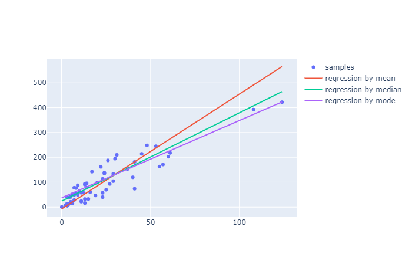
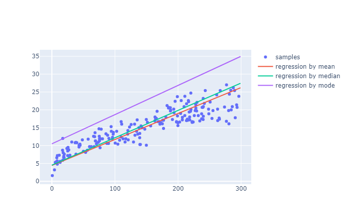

## Introduction

	In statistical modeling, regression analysis is a set of statistical processes for estimating the relationships between a dependent variable and one or more independent variables.
	The most common form of regression analysis is linear regression, in which one finds the line that most closely fits the data according to a specific mathematical criterion. 
	Regression analysis is primarily used for two conceptually distinct purposes. First, regression analysis is widely used for prediction and forecasting, where its use has substantial overlap with the field of machine learning. Second, in some situations regression analysis can be used to infer causal relationships between the independent and dependent variables. Importantly, regressions by themselves only reveal relationships between a dependent variable and a collection of independent variables in a fixed dataset. 
	To use regressions for prediction or to infer causal relationships, respectively, a researcher must carefully justify why existing relationships have predictive power for a new context or why a relationship between two variables has a causal interpretation. The latter is especially important when researchers hope to estimate causal relationships using observational data.

### 1. Insurance dataset

### 2. Advertising dataset

## Conclusion

   Observing the three various types of central values, I was able to arrive at several conclusions. In the first data set of insurance, the mode value seemed to be better than the mean value. However, when I applied the test with the second data set of advertising, the mode seemed to be worse than both the median and mean values. It was almost as if everything suddenly became the opposite. In addition, the graph already shows that the mean and median are close to each other. As a result, the mode comes from both values. That’s why the graph based on median and mode are close to each other. In the end, this investigation of the central values in the two data sets revealed much information on the relationships in regression analysis.
